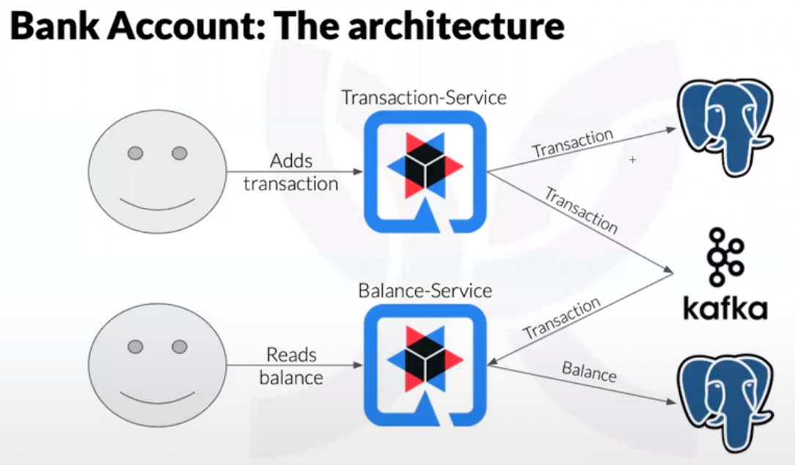

# Objective

This project was developed based on the module __Criando um sistema de orçamento, utilizando CQRS, Quarkus, Kafka e deploy no EKS__ on the DIO - DIGITAL INNOVATION ONE - __BOOTCAMP Inter Java Developer__.

Creating a budget system, using CQRS, Quarkus, Kafka and EKS deploy

Taught by _SWesley Fuchter_.

* Java 11
* Maven
* Intellj IDEA Community Edition
* GIT
* Quarkus
* KAFKA
* EKS AWS
* Docker

## About CQRS - Command Query Responsibility Segregation

According with [Martin Folwer](https://martinfowler.com/bliki/CQRS.html) 
> At its heart is the notion that you can use a different model to update information than the model you use to read information. 
> For some situations, this separation can be valuable, but beware that for most systems CQRS adds risky complexity.

## The application

Simulates a bank account scenario where an end user adds a income or expense transaction, and it is processed in a ascyncronous event sourcing and CQRS architecture to recalculate the user's bank account balance. The user can also request the balance of it's account. Down here you can see the design:



## Deploying the external services

```
docker-compose up -d --build
```
It will deploy four docker containers on your environment with MongoDB, PostgreSQL, Kafka and Zookepper (required by Kafka)

After deploying Kafka, you'll need to [create the topic on the Kafka cluster](https://kafka.apache.org/quickstart).

## Testing the application

#### Running a CURL request to create a income transaction
```
curl -X POST -H "Content-Type: application/json" -d @income-transaction.json http://localhost:8080/transactions
```
#### Running a CURL request to create a expense transaction
```
curl -X POST -H "Content-Type: application/json" -d @expense-transaction.json http://localhost:8080/transactions
```
#### Running CURL request to fetch the balance
```
curl http://localhost:8081/balance\?accountId\=wesley | json_pp
```
#### Running [K6's](https://k6.io) simple performance test
````
k6 run --vus 10 --duration 60s performance-tests/income.js
k6 run --vus 10 --duration 60s performance-tests/expense.js
````

